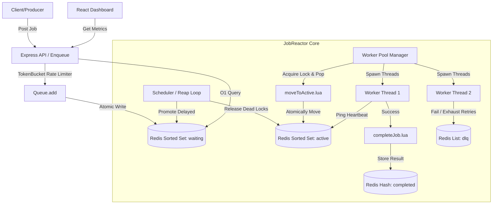

# JobReactor 🚀

[](https://github.com/YOUR_USERNAME/job-reactor/actions)
[](LICENSE)
[](https://nodejs.org)
[](https://redis.io)
[](CONTRIBUTING.md)

**JobReactor** is a high-performance, BullMQ-inspired distributed job queue built from first principles in Node.js. It leverages Redis sorted sets for priority scheduling, Lua scripting for thread-safe atomicity, Node.js Worker Threads for parallel CPU-bound job execution, and features a gorgeous real-time monitoring React dashboard.

Designed for intermediate-to-advanced developers seeking an L5-level target system implementation, JobReactor showcases distributed locks, at-least-once delivery, exponential backoff retries, dead-letter queues, and thread-pool orchestration.

---

## 🎯 Why I Built This: The Engineering Challenge (STAR Method)

### 📂 Situation
Modern backend architectures rely heavily on asynchronous task queues (like BullMQ or Celery) to process background tasks (e.g., email dispatch, image processing, report generation). However, most developers use these libraries as "black boxes" without understanding the complex distributed systems mechanics beneath. Using standard SQL databases for queueing leads to severe polling lag and database locking contention. Conversely, importing heavy, ready-made frameworks hides critical details like thread safety, atomic state changes, and distributed locks—making it extremely difficult to customize or optimize behavior under heavy traffic.

### 📋 Task
The challenge was to design and build a high-throughput, **distributed job queue from first principles** in Node.js and Redis. The goals were:
1. Guarantee **at-least-once delivery** and zero message loss, even if background worker nodes crash.
2. Eliminate **race conditions** when multiple concurrent workers attempt to acquire the same jobs.
3. Prevent CPU-bound jobs from blocking the single-threaded Node.js event loop.
4. Keep dependencies minimal—relying only on Redis (`ioredis`) and Node's native capabilities.

### ⚙️ Action
To achieve this, I implemented the following architecture:
- **Atomicity via Lua Scripting**: Coded pessimistic Lua scripts executed directly inside Redis. Because Redis runs single-threaded, these scripts run atomically, preventing multiple worker processes from popping the same job simultaneously.
- **Multi-Threaded Workloads**: Built a custom `WorkerPool` using Node.js `worker_threads` to delegate heavy CPU tasks off the main event loop, allowing worker processes to scale efficiently across multiple CPU cores.
- **Distributed Locks & Heartbeats**: Secured jobs during execution using Redis key locks (`SET ... PX ...`). Implemented active worker heartbeats that periodically extend lock TTLs, ensuring long-running processes are not cut off while crashed workers automatically yield locks for rescheduling.
- **Ingestion Protection**: Designed a native client-side rate-limiter based on the **Token Bucket** algorithm to throttle high-volume job ingestion and protect downstream services.

### 🏆 Result
The result is **JobReactor**: a fully functional, highly transparent, and robust distributed queue system that matches the operational guarantees of enterprise solutions like BullMQ.
- **Zero Race Conditions**: Atomic job acquisition via `moveToActive.lua` prevents double-processing.
- **Resiliency**: Built-in exponential backoff, retry jitter, and automatic dead-letter queue (DLQ) transitions for failing tasks.
- **Real-Time Visibility**: Provides a modern monitoring React dashboard and Express API to query queue depth and worker health instantly, proving that robust, first-principles distributed coordination can be implemented with minimal boilerplate.

---

## 🏗️ Architecture Overview

JobReactor uses a decoupled, event-driven architecture featuring a multi-threaded Worker Pool and a centralized scheduler coordinating over Redis.



---

## ✨ Key Features

- 🔒 **Atomic State Transitions**: Custom pessimistic Lua scripts ensure that jobs transition states atomically without race conditions or double-processing.
- 🧵 **Multi-Threaded Worker Pool**: Offloads execution to a pool of dedicated Node.js `worker_threads`, avoiding blockage of the main event loop and maximizing CPU core utilization.
- 📈 **TokenBucket Rate Limiter**: Implements client-side ingestion rate limiting to protect the message queue from large traffic surges.
- 🔁 **Resilient Error Recovery**: Configured with dynamic exponential backoff and randomized jitter to prevent thundering herd problems during retry storms.
- 💀 **Dead-Letter Queue (DLQ)**: Jobs exceeding the retry thresholds are safely offloaded to a dedicated list for manual inspection and re-driving.
- 🩺 **Distributed Lock Heartbeats**: Active workers send heartbeat pings to extend execution lock TTLs, allowing long-running tasks to execute safely while automatically recovering crashed worker locks.
- 🖥️ **Live Monitoring Dashboard**: A modern React-based monitoring dashboard providing real-time metric streams, queue depth visualizations, and worker health.

---

## 🚦 Job State Machine

Every job transitions through a strict cycle, avoiding lost jobs and guaranteeing *at-least-once* execution:

```
[Added] ──► [Delayed] (ZSET: retry-at timestamp)
   │             │
   │ (Immediate) │ (Delay passed)
   ▼             ▼
[Waiting] ───────┼──► [Active] (ZSET: lock-expiry TTL)
                 │       │
                 │       ├─► [Completed] (HASH: metadata)
                 │       │
                 │       └─► [Failed / Retry] ──► Back to [Delayed]
                 │               │
                 │               └─ (Max retries exceeded)
                 ▼               ▼
           [Dead-Letter Queue (DLQ)] (LIST: manual review)
```

---

## 🚀 Getting Started

### Method 1: Docker Compose (Recommended)
Spin up the entire stack (Redis, API, Worker Replicas, React Dashboard) with one command:
```bash
docker-compose up --build
```
- **React Dashboard**: Open `http://localhost:3001`
- **Express API**: Accessible at `http://localhost:3000`
- **Redis instance**: Listening on port `6379`

### Method 2: Local Manual Setup

#### 1. Start Redis
Make sure you have Redis running locally on default port `6379`.
```bash
redis-server
```

#### 2. Install Dependencies
```bash
# Install root (backend) dependencies
npm install

# Install dashboard (frontend) dependencies
cd dashboard
npm install
cd ..
```

#### 3. Setup Environment variables
Copy the template `.env.example` file and configure it:
```bash
cp .env.example .env
```

#### 4. Run Backend & Dashboard
Open three terminals or run concurrent commands:
```bash
# Terminal 1: Run worker processes
npm run start

# Terminal 2: Run API Server
npm run api

# Terminal 3: Run Frontend Dashboard
cd dashboard
npm run dev
```

---

## 🔧 API Usage & Verification

To enqueue a job, make a POST request to the API:

### ✉️ Email Send Job
```bash
curl -X POST http://localhost:3000/api/enqueue \
  -H "Content-Type: application/json" \
  -d '{
    "name": "email:send",
    "data": {
      "to": "user@example.com",
      "subject": "Welcome!",
      "body": "Thank you for signing up to JobReactor."
    },
    "opts": {
      "priority": 1,
      "attempts": 3
    }
  }'
```

### 🖼️ Heavy Image Resize Job (Delayed 5 seconds)
```bash
curl -X POST http://localhost:3000/api/enqueue \
  -H "Content-Type: application/json" \
  -d '{
    "name": "image:resize",
    "data": {
      "src": "/uploads/avatar.png",
      "width": 200,
      "height": 200
    },
    "opts": {
      "priority": 3,
      "delay": 5000
    }
  }'
```

---

## 🧪 Running Tests

JobReactor includes tests run directly via the Node.js native test runner (eliminating heavy test-framework dependencies):

```bash
# Ensure local Redis is running
npm test
```

---

## 📂 Project Directory Walkthrough

```
├── .github/                # GitHub configurations (CI, templates)
├── api/                    # Express API server for enqueuing & metrics
│   ├── server.js           # API entrypoint
│   └── metrics.js          # O(1) Redis queue depth and stats query router
├── dashboard/              # React frontend dashboard (Vite + CSS)
├── scripts/                # Lua scripts for atomic Redis state operations
│   ├── moveToActive.lua    # Lock acquisition script
│   └── completeJob.lua     # Clean completion and lock-release script
├── src/                    # Backend Queue & Worker Core
│   ├── Queue.js            # Main Queue class (enqueuing, DLQ management)
│   ├── WorkerPool.js       # WorkerPool manager (orchestrates Worker Threads)
│   ├── worker-thread.js    # Task-handlers executed inside worker threads
│   ├── Scheduler.js        # Active reapers and delay promoters
│   └── TokenBucket.js      # Rate-limiting ingestion control
├── tests/                  # Unit and integration tests
├── Dockerfile              # Container configuration for workers/API
├── docker-compose.yml      # Orchestration setup for easy scaling
└── worker.js               # Background worker process entrypoint
```

---

## 📄 License

This project is licensed under the MIT License - see the [LICENSE](LICENSE) file for details.
